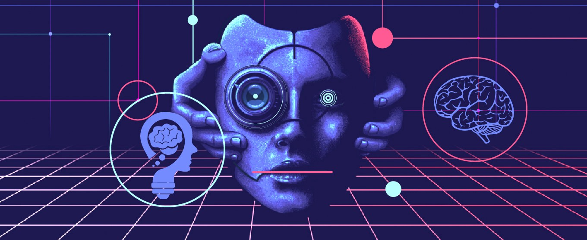

*This post is part of the KI1-EN course on ZHAW. It reflects my current views on artificial intelligence and is based on the articles "Cognitive Orthoses: Toward Human-Centered AI"[1] and "The Artificial Intelligence Revolution: The Road to Superintelligence" [2]. In a few months, this post is followed up by another that discusses my updated view on this topic.*

It seems that the field of artificial intelligence is roughly divided into two groups: the technical one one hand, that utilize tools such as computers and machine learning to pragmatically solve real-world problems (and sometimes appear to find new problems to solve), and on the other hand, the philisophical that asks and often eagerly answers deep questions that rise when imagining a superintelligent that surpasses human's capabilities.

The discussed articles seem to appropriately fit each in one of those groups. Honoring those who have done before, I shall not delve into another philosophical discussion at this point.

The notion about AI I feel most comfortable with is a broad range of applications of clever computer algorithms that suggest some kind of intelligence that we see in humans or animals. Examples I know are pattern recognition, data aggregation and interpretation of ambiguous meaning (for instance interpreting search queries in natural language), often referred to as ANI. Underlying reason that this topic is intensively discussed now is most probably the development of sufficiently powerful computing hardware, the results of which impress us.

Hence, Ford's notion about AI as orthosis fits AI's capabilities today best in my perspective. Still, I don't want to neglect the ideas introduced by Ray Kurzweil, Nick Bostrom and "summarized" by Tim Urban. Intuitively, this rather shocking article resembles a *Deus ex machina* scenario to me. My reaction to it was not unlike one the first *Deus ex machina* device's criticists Antiphanes' reaction, who stated:

*when they don't know what to say*
*and have completely given up on the play*
*just like a finger they lift the machine*
*and the spectators are satisfied.*

The difference to its theatrical metaphor however boldly appears as with the spectators are not satisfied upon learning that a superintelligence may be humankinds last invention. With this exception, Antiphanes perhaps understood humans' affection to drama and perhaps this is what we see today.

I however want to elaborate on a more technical idea - but no objection - why I prefer the orthosis view. In the last fifty years the so often cited augmentation in semiconductor density has been fruitful in many aspects and has probably been the fiercest candidate to rival animal or human's brain. Donald Knuth's considerations about computers that become proficient in human's thinking tasks describes the situation quite accurately.

The claim that human-like intelligence may soon be surpassed by computers - or to be more precise - semiconductors is perhaps a hubris following this impressive technological development. Human intelligence is centered around the human brain, which inner functioning is not known completely. It shows the ability to "change its programming during runtime" i.e. learning. From a computer scientist's view, this ability shows a stark difference to a computers's working which is deterministic. For a computer to execute an action, it had to be programmed prior. When a computer algorithm does something better than a human (recognizing faces, for instance), this does not necessarily mean that it is intelligent as for instance a dog is. I can imagine, that as AI research delves into new tasks, insight about what intelligence really is, is won.

To conclude, I don't think that a true artificial intelligence is impossible, I rather suppose that it is more complex than it is currently often thought, as there may be more distinctions and layers that are yet concealed. Also, perhaps it's not silicon artificial brains are made of, but living matter, as Freeman Dyson states in [3]:

*I predict that the domestication of biotechnology will dominate our lives during the next fifty years at least as much as the domestication of computers has dominated our lives during the previous fifty years.*

**Sources:**

[1] Kenneth M. Ford et al., "Cognitive Orthoses: Toward Human-Centered AI", AI Magazine, winter 2015, pp. 5-8, 2015.
[2] Tim Urban, "The Artificial Intelligence Revolution: The Road to Superintelligence", Wait but why? blog, 22.01.2015-27.01.2015.
[3] Freeman Dyson, "Our biotech future." The New York Review of Books 54.12 (2007).

